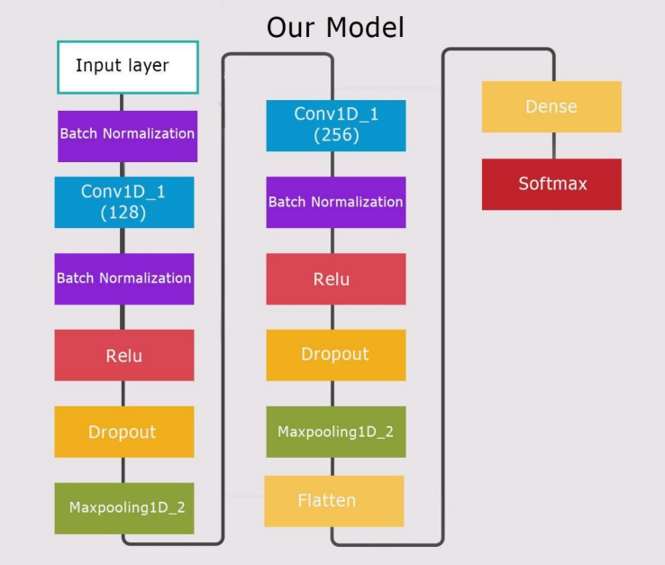
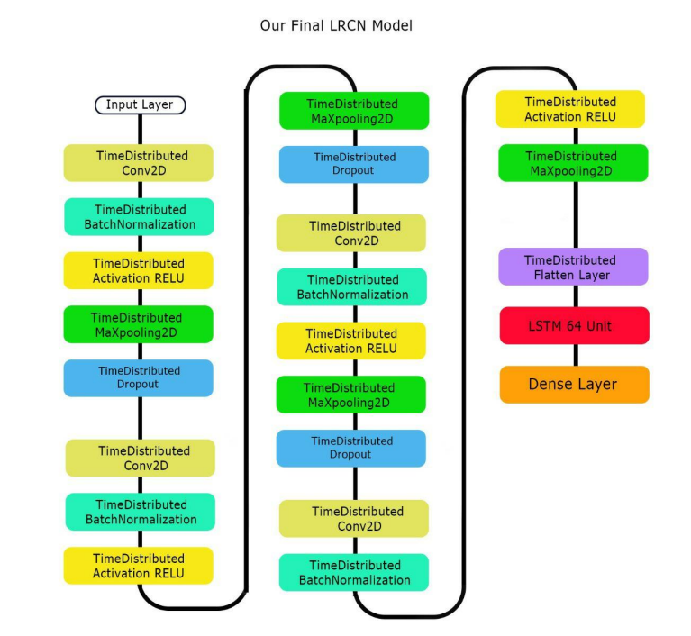
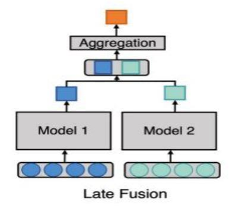

# Audio-Visual Emotion Recognition Project

The goal of this project is to recognize human emotions from audio and video inputs, using the SAVEE and RAVDESS datasets. The project consists of three phases: audio, video, and fusion, each using different techniques and models to improve emotion recognition accuracy. This is our graduation project 2021-2022. This repo contain our final work to check all our work visit this [link.](https://github.com/mahmoudmohamed22/Emotion-Recognition-From-Video-and-Sound)

***
## Technology Used

- Python 
- Keras
- Sklearn
- matplotlib
- numpy
- pandas
- tensorflow

### Audio Phase
- Mel Frequency Cepstral Coefficient (MFCC) and Spectrogram for feature extraction
- Different models including CNN, 2D CNN, VGG16, and others.

### Video Phase
- RAVDESS Landmark Dataset for video feature extraction
- Models used include LRCN Model and ConvLSTM Model.

### Fusion Phase
- Late fusion using machine learning techniques such as Logistic Regression, SVM, KNN, and MLP for predictions at the decision level.

***

## Team Members
- [Mahmoud Abd ElWahab](https://github.com/mahmoudmohamed22)
- [Marwa Adel](https://github.com/MarowaAdel28)
- [Amr Kamal](https://github.com/amrkamalfoad)
- [Mariam Maher](https://github.com/mariammaher11)
- [Mohamed Ramadan](https://github.com/moramadan98)

***

## DataSet
Two datasets were used in this project: RAVDESS and SAVEE. 
- RAVDESS (Ryerson Audio-Visual Database of Emotional Speech and Song) dataset [1] consists of 24 professional actors who perform 8 different emotions (calm, happy, sad, angry, fearful, surprise, disgust, and neutral) in speech and song. The dataset includes 1440 files in total. 

- SAVEE (Surrey Audio-Visual Expressed Emotion) dataset [2] consists of 4 male actors who perform 7 different emotions (anger, disgust, fear, happiness, sadness, surprise, and neutral) in speech. The dataset includes 480 files in total.

***

## Models
### Audio Model

### Video Model

### Late Fusion Model

***

## Results
The best accuracy achieved by our models in each phase is as follows:

### Audio Phase
First we extract audio features using two methods Mel Spectrogram and MFCC. We tried different models using Mel spectrogram and MFCC and found that the range of accuracy of :
- Mel spectrogram is 58% - 69%. 
- MFCC is 69% - 73%. 

we found that MFCC has higher accuracy than Mel spectrogram, so we choose MFCC to extract features from our audio files. After extracting features by MFCC, which feed into our network. 

We worked on two models and tried to improve them. 

- The first model consists of two parallel CNN [3] and achieved 73% as an average accuracy. We tried to improve it and our modifications on it improved its accuracy by 7% Approximately. Our improved model achieved 80.86% as the best accuracy on the RAVDESS dataset. 

- The second model, we implement the model architecture in "Emotion Recognition from Speech Signals Using Machine Learning and Deep Learning Techniques" paper [4], Original model achieved 70.83% on the RAVDESS dataset and classified 8 emotions. Our modifications On CNN model improved accuracy by 17% approximately. Our model achieved 87.4% as the best accuracy on the RAVDESS dataset and classified 6 emotions. And 83.3% as the best accuracy on SAVEE dataset.

- Final CNN model: 87.4% on the RAVDESS dataset and 83.3% on the SAVEE dataset.

### Video Phase

In the Video phase we used landmarks to extract frames from video. We Used two models LRCN and ConvLSTM which used to Classify human activity in Two papers [5][6]. 

- The original ConvLstm model Achieved on RAVDESS data set 74.8% and on a SAVEE dataset 91.67%. Our Modifications on ConvLSTM model improved accuracy by 10% approximately on RAVDESS. The final ConvLstm was achieved on the RAVDESS data set 84.54% and On the SAVEE Dataset 94.44%.

- The second model LRCN, the original LRCN model was achieved on the RAVDESS data Set 80.67% ± 2.18% and on the SAVEE data set 86.81% ± 2.78%. Our modifications On LRCN model improved accuracy by 13% approximately on the RAVDESS dataset. 

- The final LRCN model Was achieved on the RAVDESS data set 93.27% ± 2.66%. And on the SAVEE data set 95.24% ± 2.78%.

### Fusion Phase

- In the fusion phase, we fused between our Video and Audio Model by building ML models. So we build different ML Models such as LR, SVM, KNN and MLP. 

- Compare With “ A Proposal for Multimodal Emotion Recognition Using Aural Transformers And Action Units on RAVDESS Dataset” paper [7] which achieved 86.70% on RAVDESS data set, our ML fusion Model (MLP) achieved 95.36% ± 2.18% on RAVDESS data set.

- MLP achieved the best average accuracy: 95.36% on the RAVDESS dataset and 95.83% on the SAVEE dataset.

## References

[1] S. R. a. F. A. R. Livingstone, "The Ryerson Audio-Visual Database of Emotional Speech and Song (RAVDESS): A dynamic, multimodal set of facial and vocal expressions in North American English," PloS one, 2018.

[2] P. a. S. H. Jackson, "Surrey audio-visual expressed emotion (savee) database," 2014.

[3] LinaZenkov, 6 Nov 2020. [Online]. Available: https://github.com/IliaZenkov/transformer-cnn-emotion-recognition

[4] G. e. a. Kataria, "Emotion Recognition from Speech Signals Using Machine Learning and Deep Learning Techniques," Springer, p. 10, 2021.

[5] L. A. H. M. R. S. V. S. G. S. T. D. Jeff Donahue, "Long-Term Recurrent Convolutional Networks for Visual Recognition and Description," IEEE, 2015. 

[6] X. S. Z. C. H. W. D.-Y. Yeung, "Convolutional LSTM Network: A Machine Learning Approach for 
Precipitation Nowcasting," 2015. 

[7] *. ,. R. K. 1. ,. D. G. 2. ,. Z. C. 2. ,. J. M. M. 1. F. F.-M. Cristina Luna-Jiménez 1, "A Proposal for Multimodal Emotion Recognition Using Aural Transformers and Action Units on RAVDESS Dataset," ,Grupode Tecnología del Habla y Aprendizaje Automático (THAU Group), p. 23, 30 12 2021.